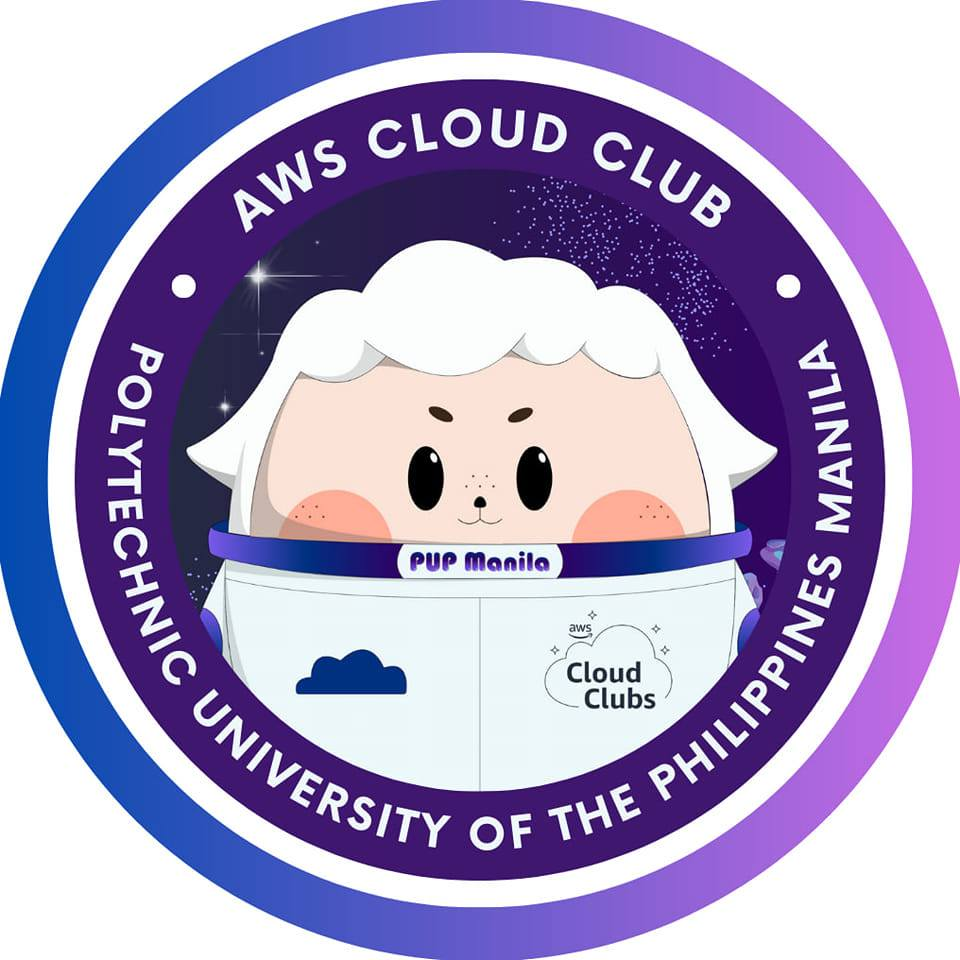

<TagLinks/>

  

    
  

  <h1>Alf the Cloud Guru</h1>

  <h2>About Me</h2>
  
I am a proud member of the AWSCC - PUP Manila Cloud Computing Department and I like working with the members of this orgranization because they are very awesome and they are pretty good! They always protect me from bad things and teach me all they know. I love the people at AWSCC - PUP Manila.

  <h2>Dream</h2>
  
My dream is to be the greatest cloud architect in the world and provide everyone a solution using the cloud!

  <h2>Social Links</h2>
  <ul>
    <li>
      

        <a href="https://www.facebook.com/AWSCloudClubPUPManila">FaceBook Page</a>
      

    </li>
    <li>
      

        <a href="https://www.linkedin.com/company/awscc-pupmanila">LinkedIn Page</a>
      

    </li>
    <li>
      

        <a href="https://github.com/AWS-Cloud-Club">GitHub Page</a>
      

    </li>
  </ul>

