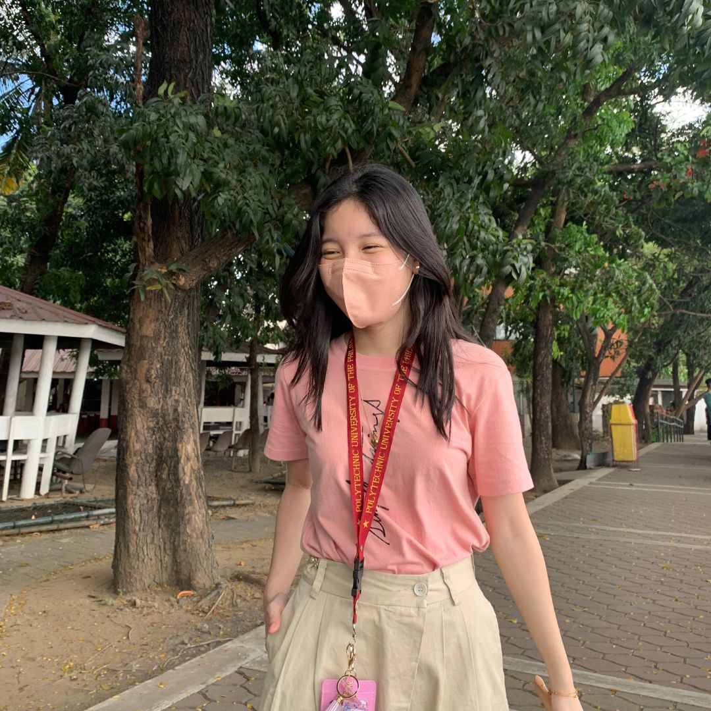

<TagLinks/>

  

  <h1>Francine Nastassja P. Jara</h1>

  <h2>About Me</h2>
  
Hello there! I'm a passionate individual with an insatiable curiosity that fuels my love for learning. Whether it's diving into a new subject, exploring different cultures through literature, or tackling a challenging project, I thrive on the excitement of discovery.

A self-proclaimed bookworm, you'll often find me immersed in the world of words, both as a reader and a writer. There's something magical about the way stories unfold and ideas come to life on the pages of a book. Writing, for me, is a way to contribute my own narrative to the rich tapestry of human experiences.

I pride myself on being a fast learner, always eager to adapt to new situations and acquire new skills. The world is full of fascinating knowledge waiting to be uncovered, and I'm determined to soak it all in. With a heart that beats for learning, I'm on a perpetual journey to expand my horizons and embrace the endless possibilities that come with a curious mind.

  <h2>Dream</h2>
  
Picture this: In the not-so-distant future, I wake up every morning to the soft hum of servers and the gentle purring of my furry companions. As a skilled software engineer, my days are filled with the exhilarating challenge of crafting elegant solutions to complex problems. I revel in the dance of code, transforming abstract ideas into tangible, functional systems.

In the evenings, I return to a cozy home, where the air is filled with the soothing presence of my many feline friends. Each cat has its own unique personality, providing endless entertainment and unwavering companionship. Their playful antics and comforting purrs create a sanctuary from the digital world I navigate during the day.

My life is stable and fulfilling, a delicate balance of technological innovation and the simple joys of a harmonious home. I find solace in both the ethereal beauty of cloud formations and the intricate architecture of software systems. It's a dream where I've not only found professional success but also surrounded myself with the warmth of a loving community—both human and feline.

  
  <h2>Goal This Year</h2>
  
This year, my goal is to immerse myself in the world of coding, building a solid foundation that allows me to speak the language of technology fluently. I aim to not only understand the intricacies of various programming languages but also to apply that knowledge in real-world projects.

One aspect of my goal is to embark on personal coding projects, where I can unleash my creativity and see my ideas come to life through lines of code. These projects will be a testament to my growth and a canvas for innovation, allowing me to explore the boundless possibilities within the realm of coding.

Additionally, I aspire to collaborate on projects with individuals I deeply admire in the coding community. Working alongside these idols will not only provide invaluable learning experiences but also open doors to new perspectives and approaches to problem-solving. Through these collaborations, I hope to contribute meaningfully to projects that have the potential to make a positive impact.

By the end of the year, I envision myself not just as a coder, but as a creator, collaborator, and contributor to the ever-evolving landscape of technology.

  <h2>Social Links</h2>
  <ul>
    <li>
      

        <a href="https://www.facebook.com/paris.jaraaa">LINK</a>
      

    </li>
    <li>
      

        <a href="https://www.linkedin.com/in/francine-nastassja-jara-99a454246/">LINK</a>
      

    </li>
    <li>
      

        <a href="https://github.com/SSJIORI">LINK</a>
      

    </li>
  </ul>

