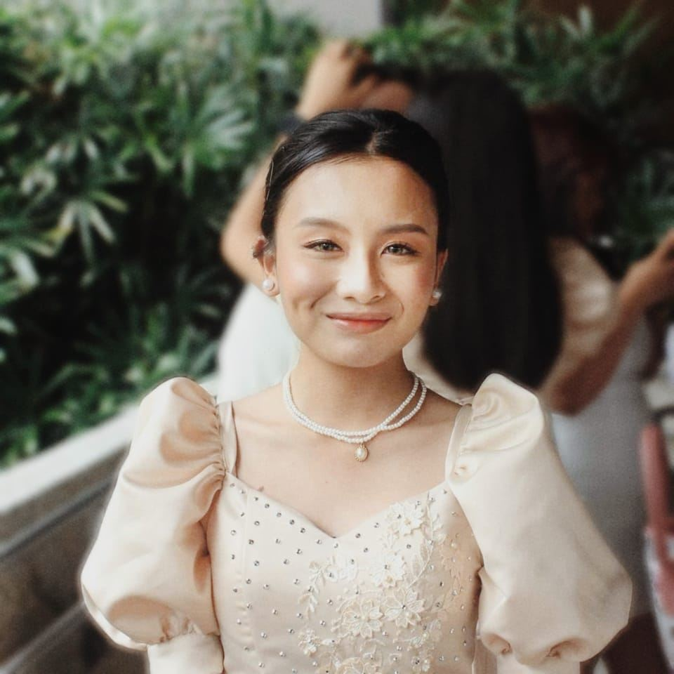

<TagLinks/>

  

    
  

  <h1>Gaile C. Espinosa</h1>

  <h2>About Me</h2>
  
Hi there! My name is Gaile Espinosa, a 19-year-old Information Technology (IT) student at Polytechnic University of the Philippines (PUP) - Manila. I am someone who gets a thrill out of discovering something new every day, whether it's a new recipe or the secret to loving oneself. My interests encompass a wide variety of media, including video games, music, and films. 

The fact that I chose the Bachelor of Science in Information Technology (BSIT) as my major in college always surprises people. To be fair, I can't say that I blame them; after all, I did graduate from Senior High School (SHS) with a degree in Humanities and Social Sciences (HUMSS). However, I don't see anything wrong with redirecting your academic interests; I, for one, think there's sure to be something exciting and unique happening in the technological world, which is why I enrolled in this program.

With the help of the AWSCC Organization, I want to further acquire knowledge in the subject of technology, which I am really interested in. I am excited to be in this organization that is both innovative and collaborative, where I can learn from and contribute to the success of others. I am also looking forward to learning from the many experiences of the members of the AWSCC Organization and bringing my knowledge and expertise to use on projects.

  <h2>Dream</h2>
  
My ultimate dream is to have the ability to be a person who serves as a tool for other individuals to accomplish their aspirations and objectives in life.

  
  <h2>Goal This Year</h2>
  
My goals for this year include becoming fluent in one programming language and settling into my chosen program (BSIT) to its fullest extent possible. In addition, I want to improve my abilities and productivity by keeping informed of technological developments and by acquiring knowledge of new programming frameworks and tools. Lastly, I want to attend tech meet-ups and be an active member of this organization in order to broaden my professional network and learn from the experiences of seasoned experts.

  <h2>Social Links</h2>
  <ul>
    <li>
      

        <a href="https://web.facebook.com/gaileespns">Facebook</a>
      

    </li>
    <li>
      

        <a href="https://www.linkedin.com/in/gaile-espinosa-117881294/">LinkedIn</a>
      

    </li>
    <li>
      

        <a href="https://github.com/gailespns">Github</a>
      

    </li>
  </ul>

