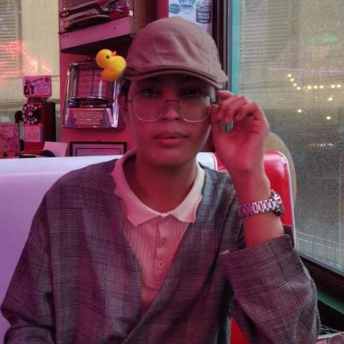

<TagLinks/>

  

  <h1>Jerald B. Adlawon</h1>

  <h2>About Me</h2>
  
Hello, I'm Jerald B. Adlawon, a 19-year-old currently pursuing a Bachelor of Science in Information Technology. As a hardworking and persistent student, I am dedicated to expanding my knowledge in the ever-evolving field of technology. Outside of academics, I find joy in immersing myself in the realms of literature, online gaming, and TV shows. I have a genuine passion for learning and continuously seek to broaden my understanding of life. Whether I'm delving into the pages of a book, engaged in virtual adventures, or exploring the narratives of TV shows, I embrace each opportunity to gain valuable insights and enrich my overall perspective.

  <h2>Dream</h2>
  
I dream of succeeding in information technology, inspired by Bruno Mars' 'I wanna be a billionaire.' Beyond just making money, I want to make a positive impact by coming up with cool tech solutions. I'm learning and staying updated in this ever-changing field, and success, for me, means not just growing personally but also making a difference in tech. I see failures as opportunities to learn, and my goal is to be a successful person who makes a positive mark in the tech world.

  
  <h2>Goal This Year</h2>
  
This year, I want to learn a lot and become a better person. I'm focusing on growing personally and understanding more about the world. I aim to be more mature by reflecting on experiences and learning from them. I'll explore different subjects to challenge myself and improve. It's not just about gathering facts, but also developing better emotional understanding and communication skills. I'm ready to step out of my comfort zone, face challenges, and use resources like books and courses. By the end of the year, I hope to be a wiser and more resilient version of myself, ready to handle whatever comes my way.

  <h2>Social Links</h2>
  <ul>
    <li>
      

        <a href="https://www.facebook.com/jerald.adlawon/">Facebook</a>
      

    </li>
    <li>
      

        <a href="https://www.linkedin.com/in/adlawon-jerald-b-818377296/">LinkedIn</a>
      

    </li>
    <li>
      

        <a href="https://github.com/jera1d">GitHub</a>
      

    </li>
  </ul>

