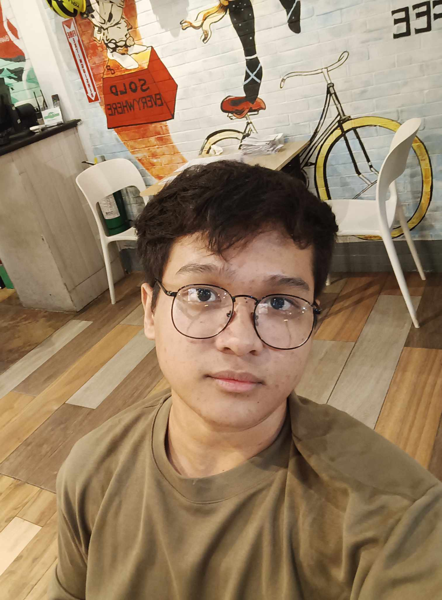

<TagLinks/>

  

    
  

  <h1>Neil Xander C. Sabulao</h1>

  <h2>About Me</h2>
  
Hello. I'm an IT Student that knows little about programming. To Tell you the truth, my SHS Track is not aligned with what I'm learning today in College. I took ICT-CSS, it might look like we are learning about CSS - Cascading Style Sheets, but in truth, it's about CSS - Computer System Servicing. I'm kind of regretting my choices in life but that's not stopping me for becoming a succesful person. I have 2 sisters in which I am the oldest. I like sports, video games. I'm starting to improve myself day by day. I like to know more about programming since it peaked my interest in my SHS days, even though it always gives me headaches.

  <h2>Dream</h2>  
  
My dream is to become someone you can trust. Well in my terms, someone you can trust in doing something related to technology. I like helping people that does not have prior knowledge in something, particularly technology. It gives me a sense of responsibility, and the payback is their "Thank you". It's such a warm feeling. I very much like to do better.

  
  <h2>Goal This Year</h2>
  
Survive College hehe.

  <h2>Social Links</h2>
  <ul>
    <li>
      

        <a href="https://www.facebook.com/xzander.neil26">Facebook</a>
      

    </li>
    <li>
      

        <a href="https://www.linkedin.com/in/neil-xander-colaton-sabulao-4b7b8229a/">LinkedIn</a>
      

    </li>
    <li>
      

        <a href="https://github.com/Xzander21">GitHub</a>
      

    </li>
  </ul>

