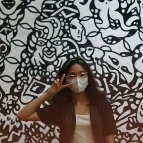

<TagLinks/>

  

  <h1>Tessa Erika A. De Guzman</h1>

  <h2>About Me</h2>
  

Hey! I'm Tessa Erika De Guzman, a second-year student at the Polytechnic University of the Philippines. I'm the Social Media Head for PUP's Programmers' Guild.

When I'm not buried in books, I'm all about creativity, planning, and strategy. I like bringing a research vibe to decision-making and building connections for organizational growth.

I'm pretty good at making communication stand out through content marketing, and my secret weapon? Analytics skills for constant improvement.

Exciting news—I snagged the Social Media Head and Vice President titles this year. Juggling studies and student org life is a crazy ride, but I'm making it work and still rocking it as a student. Here's to staying busy and making things happen! 

  <h2>Dream</h2>
  

  I've always dreamed of having a lot of money and living a comfortable, carefree life. I want to be able to enjoy everything I like and help out my family and others. My goal is to work hard, plan smart, and grab opportunities that will help me get rich and secure.
  

  
  <h2>Goal This Year</h2>
  

  Securing enhypen concert ticket
  

  <h2>Social Links</h2>
  <ul>
    <li>
      

        <a href="https://www.facebook.com/tessaerika.deguzman/">Facebook</a>
      

    </li>
    <li>
      

        <a href="https://www.linkedin.com/in/tessa-erika-d-53aa77265/">LinkedIn</a>
      

    </li>
    <li>
      

        <a href="https://github.com/AssetAkire">GitHub</a>
      

    </li>
  </ul>

